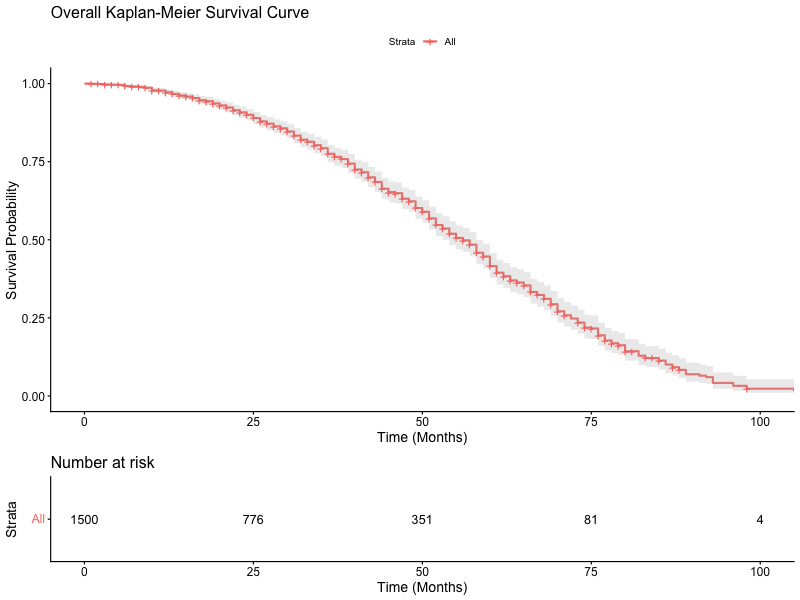
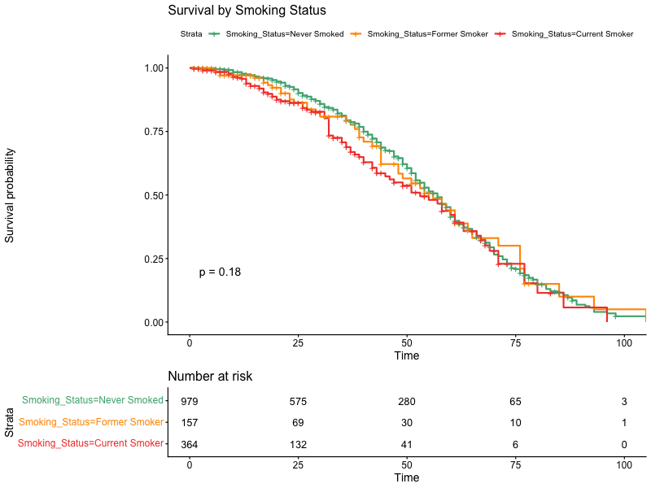
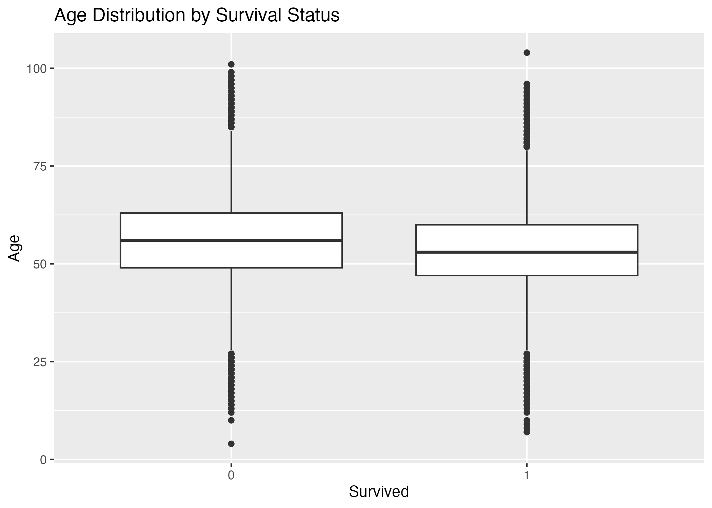
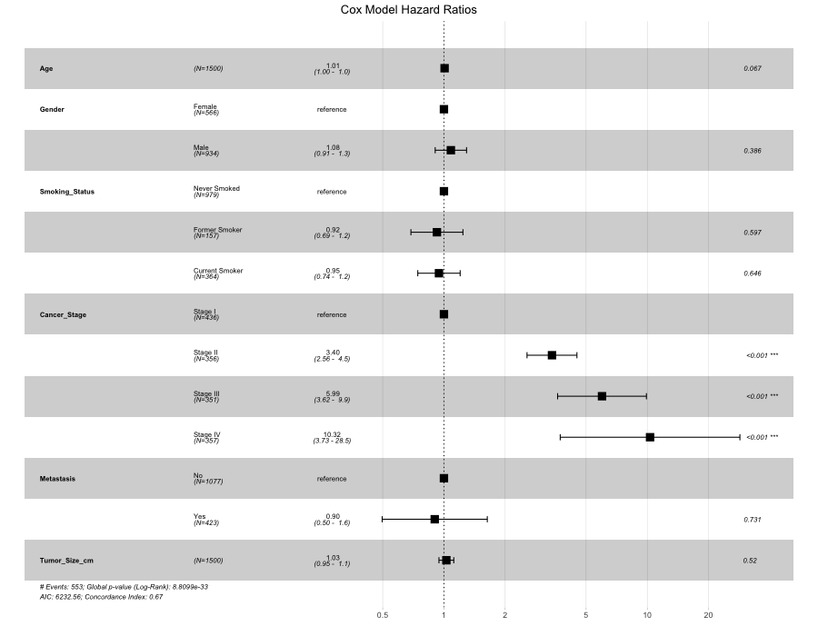

# Lung Cancer Survival Analysis

Survival analysis of lung cancer patients using Kaplan-Meier curves 
and Cox proportional hazards models in R.

## Dataset
- 1,500 patient records across 60 countries (2015–2025)
- 41 variables including demographics, risk factors, treatment, and survival outcomes
- Source: [Kaggle - Lung Cancer Global Clinical Dataset](https://www.kaggle.com/datasets/zkskhurram/lung-cancer-global-clinical-risk-factor-dataset)
- `sample_data.csv` contains 100 rows for preview

## Research Questions
1. What is the overall survival probability over time?
2. Does smoking status significantly affect survival?
3. Which clinical factors are independent predictors of survival?

## Scripts
Run in order:
- `01_data_cleaning.R` — loads and prepares the dataset
- `02_eda.R` — exploratory data analysis and visualizations
- `03_km_analysis.R` — Kaplan-Meier survival curves and log-rank tests
- `04_cox_model.R` — Cox model, diagnostics, and forest plot

## Requirements
```r
install.packages(c("survival", "survminer", "dplyr", "ggplot2"))
```
## Key Figures

### Overall Kaplan-Meier Survival Curve


### Survival by Smoking Status


### Survival by Cancer Stage


### Survival by Treatment Type


### Cox Model Hazard Ratios

## Key Results

Model results including the Cox model summary, proportional hazards 
test, and goodness-of-fit test are saved in `cox_model_summary.txt`.
